# 📘 Storybook Practicum – Flutter Interactive Story

Storybook Practicum adalah aplikasi Flutter sederhana yang dirancang sebagai buku cerita interaktif. Aplikasi ini terdiri dari 3 halaman utama: halaman judul, halaman cerita interaktif, dan halaman akhir. Pengguna dapat melakukan gesture seperti double tap, long press, drag-and-drop, dan zoom untuk berinteraksi dengan karakter dan objek di dalam cerita.

## 🧩 Fitur Aplikasi

- 🎬 **Halaman Judul** – Tampilkan judul cerita dan tombol mulai.
- 🪐 **Halaman Cerita** – Latar angkasa yang bisa di-zoom dan digeser. Interaksi mencakup:
  - 👩‍🚀 **Double Tap** pada karakter astronaut untuk menampilkan dialog.
  - 📦 **Long Press** pada peti untuk melihat petunjuk.
  - 🔑 **Drag-and-Drop** kunci ke peti untuk membukanya.
  - 🔍 **InteractiveViewer** untuk zoom dan pan latar belakang.
- 🎉 **Halaman Akhir** – Muncul setelah peti dibuka.

## 📸 Cuplikan Layar

| Halaman Judul                     | Halaman Interaktif                | Halaman Akhir                   |
| --------------------------------- | --------------------------------- | ------------------------------- |
| 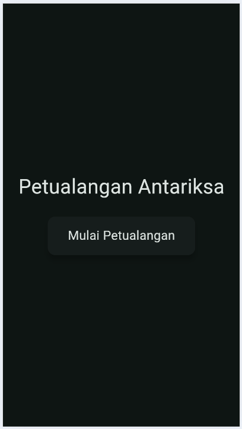 | 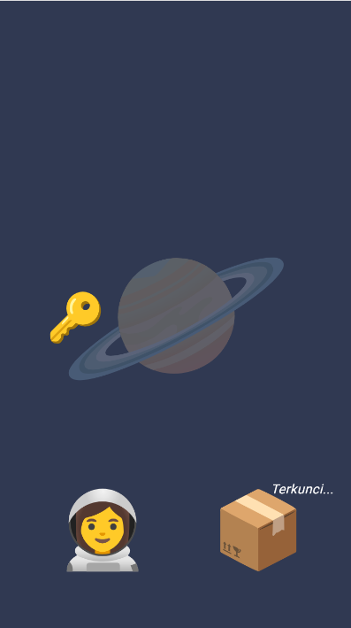 | 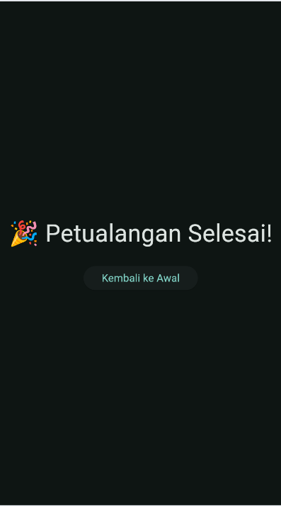 |


## 🚀 Cara Menjalankan

1. **Clone repo ini:**

   ```bash
   git clone https://github.com/username/storybook_practicum.git
   cd storybook_practicum
   ```

## 📘 Laporan Langkah-Langkah Proyek storybook_practicum

1.	Buat proyek flutter baru → storybook_practicum
    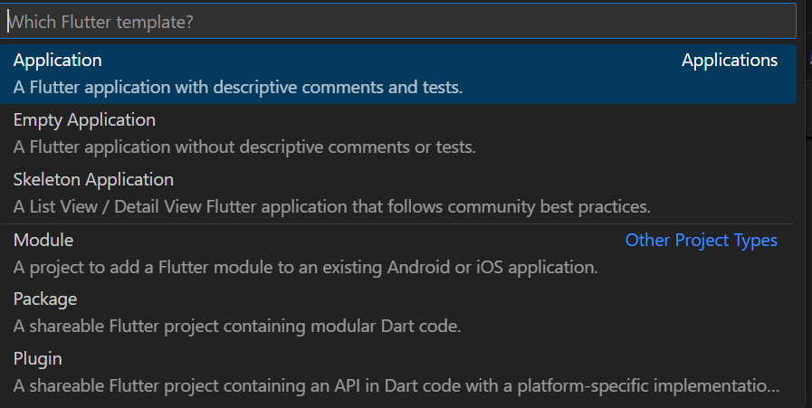
2.	Membuka proyek di code editor (VS Code/Android Studio)
    ![]images/langkah2.png)
3.	Di dalam lib buat folder pages di dalamnya terdapat 3 files: title_page.dart, scene_page.dart, end_page.dart
    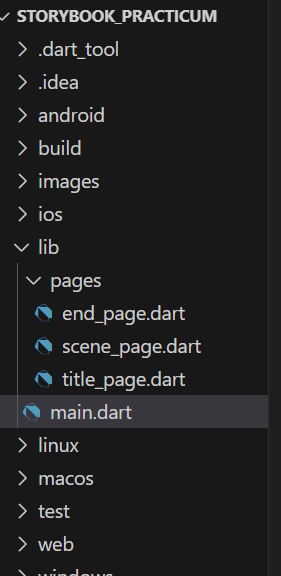
4.	Buka lib/main.dart dan ganti isinya untuk membuat struktur PageView.
    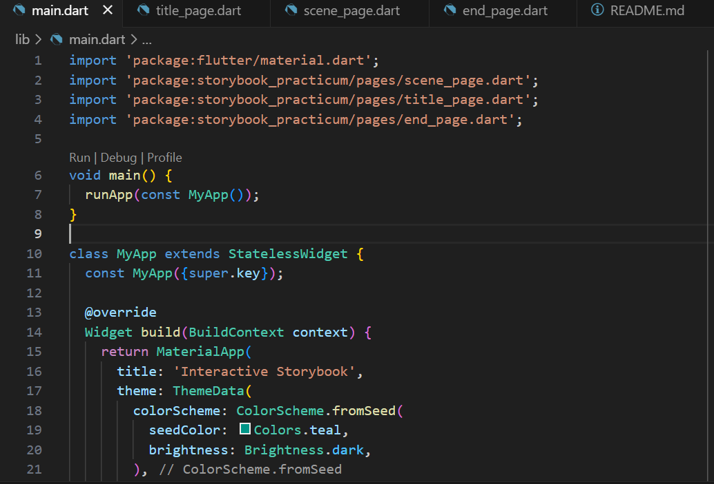
5.	Untuk mencegah error, isi setiap file di folder pages dengan StatelessWidget boilerplate sederhana. Contoh untuk title_page.dart
    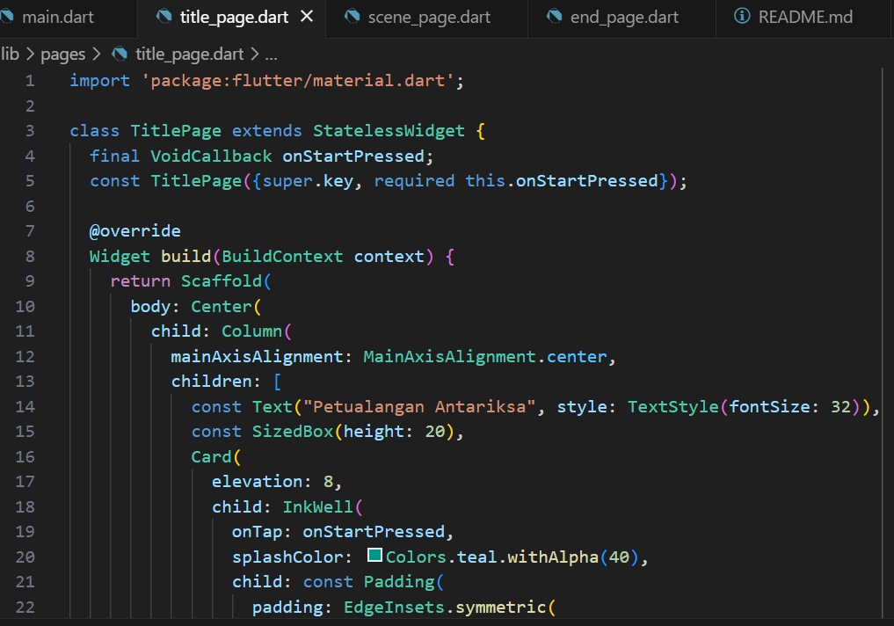
6.	Lakukan hal yang sama untuk scene_page.dart dan end_page.dart, cukup tampilkan teks judul halaman.
7.	Fokus pada lib/pages/scene_page.dart → ganti isinya dengan kerangka StatefulWidget
    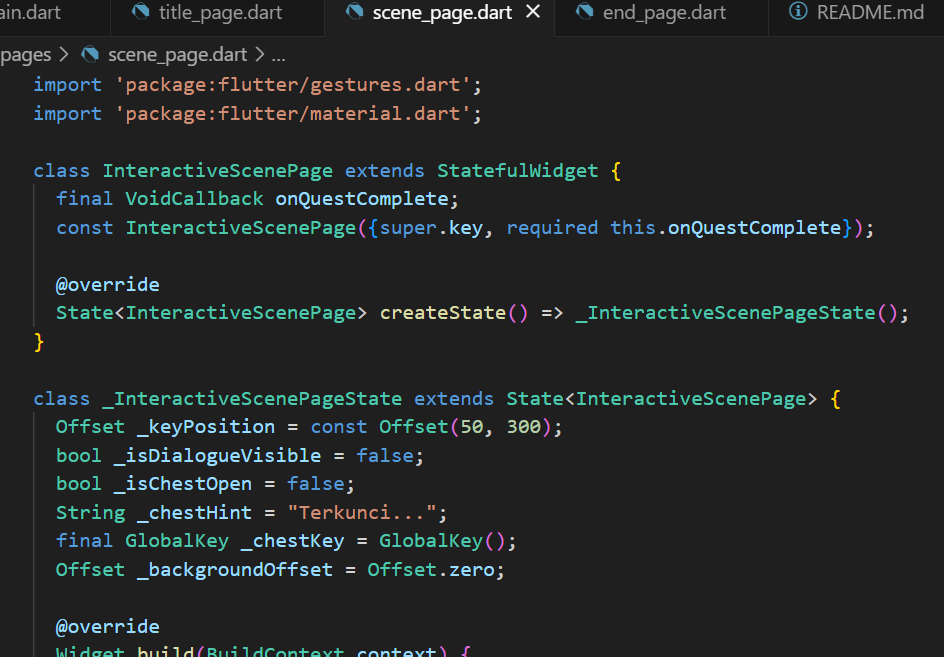
8.	Tambahkan Astronaut & Balon Dialog (Double Tap). Di dalam Stack, tambahkan Positioned untuk astronaut
    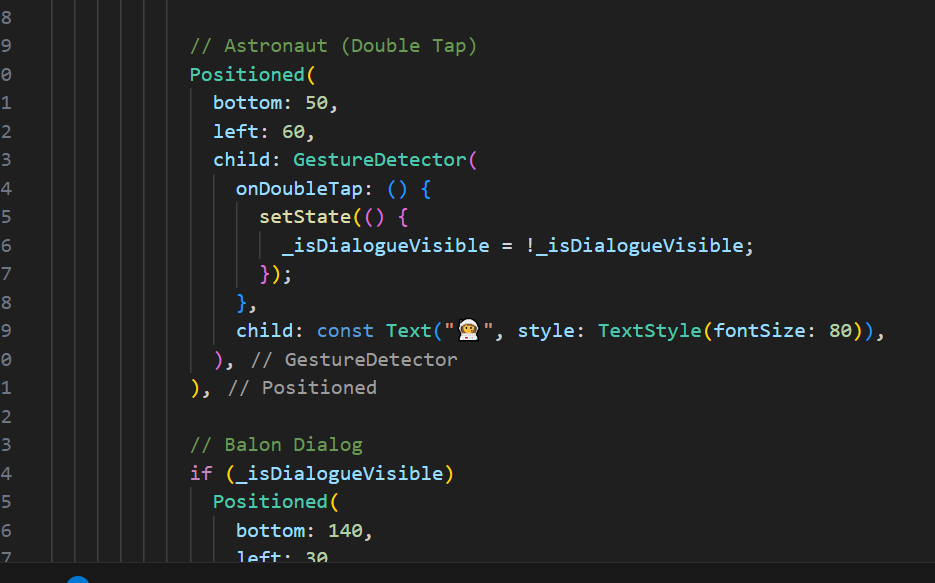
9.	Tambahkan Peti & Petunjuk (Long Press). Di dalam Stack, tambahkan Positioned untuk peti.
    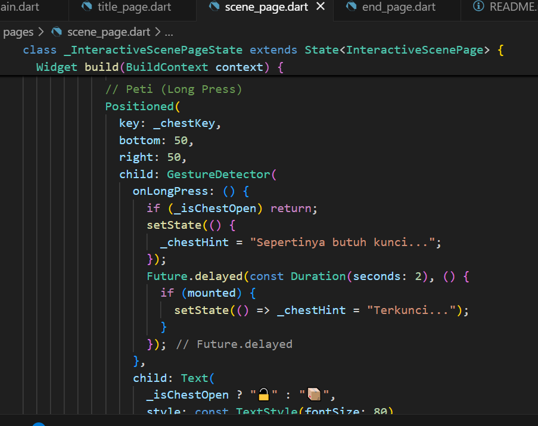
10.	Tambahkan Kunci & Logika Drag-and-Drop. Di dalam Stack, tambahkan Positioned untuk kunci.
    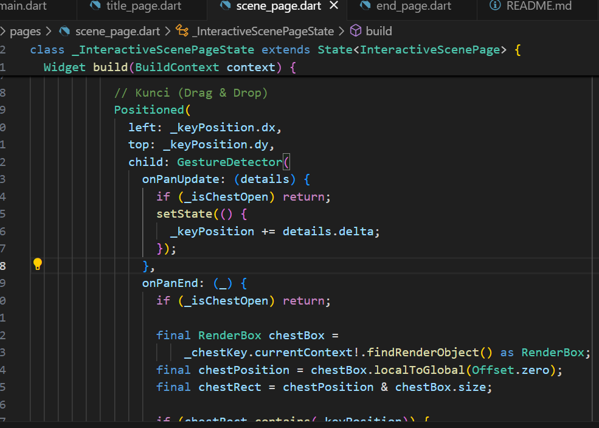
11.	Hot Reload & Uji Coba: Coba semua interaksi: double tap astronaut, long press peti, dan geser kunci ke peti
    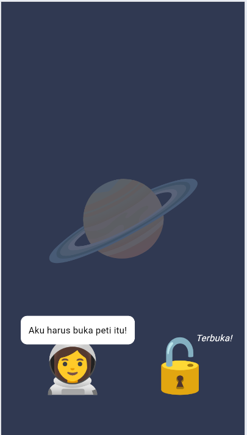
12.	Efek Visual (InkWell) → Buka lib/pages/title_page.dart, Bungkus ElevatedButton dengan Card dan InkWell untuk efek yang lebih bagus.
    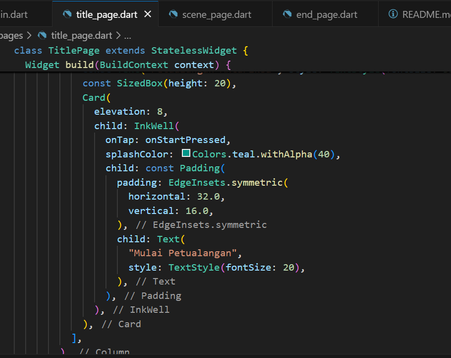
13. Kita akan membuat latar belakang bisa digeser sedikit secara horizontal atau vertikal (seperti melihat lewat teleskop), tapi tidak keduanya sekaligus.
14.	ke lib/pages/scene_page.dart, modifikasi Container latar belakang. Pertama, tambahkan Offset untuk posisi background di State.
    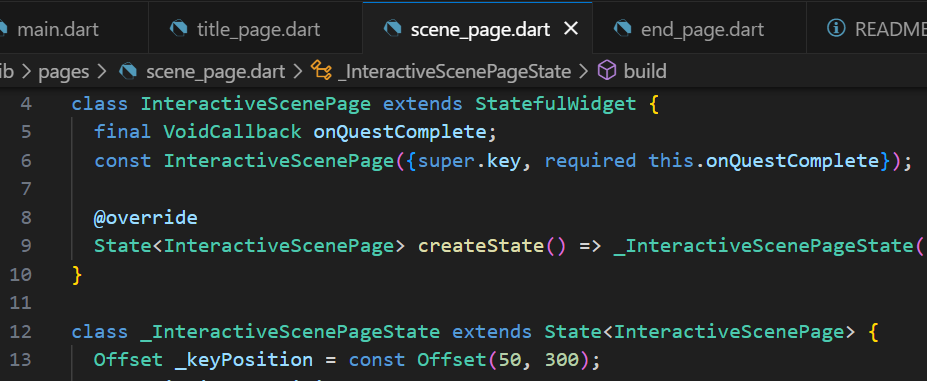
15.	Bungkus Container latar belakang dengan RawGestureDetector dan Transform.
    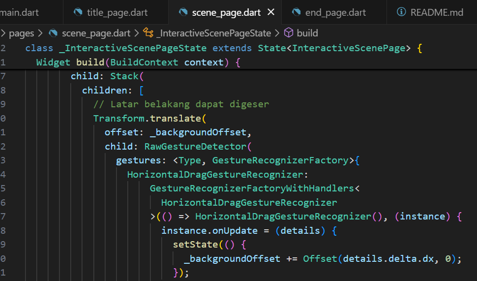
16.	Ujicoba: Coba geser latar belakang. Kalian hanya bisa menggesernya di satu sumbu (horizontal atau vertikal) dalam satu waktu.
    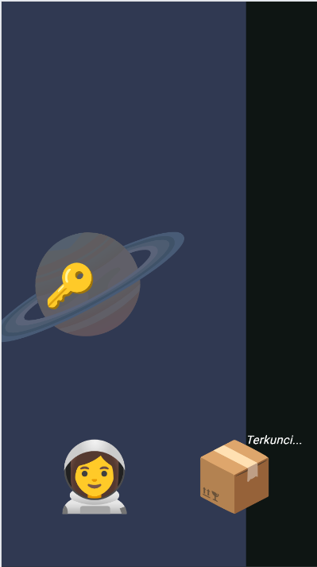
17.	Fungsionalitas Zoom dengan InteractiveViewer
18.	Di lib/pages/scene_page.dart, bungkus seluruh Stack dengan widget InteractiveViewer
    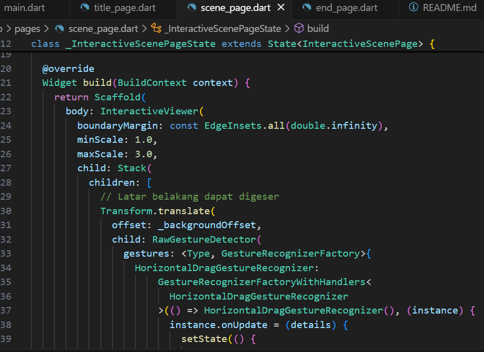
19.	Hot Reload dan seluruh adegan interaktif bisa di-zoom dan di-pan dengan mudah.

